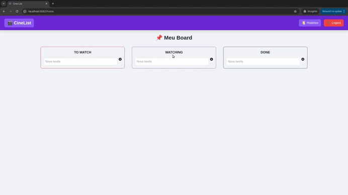

  

  

  <h1>Cine List</h1>

🚧 **ATENÇÃO: ESTE PROJETO ESTÁ EM DESENVOLVIMENTO!** 🚧

  

     Plataforma para acompanhamento do consumo de mídias
  

---

  <!-- Status da CI/CD (link) - Em validação... -->

  <!-- Tecnologias -->

## ⚠️ **Aviso Importante - Cold Start nas Funções Lambda**

**Devido às funções Lambda operarem por eventos, elas ficam no estado _cold start_ ao serem invocadas pela primeira vez após um período de inatividade.**

⚡ Impacto: Para evitar custos adicionais, optei por não utilizar o serviço "Keep Alive" da AWS, que manteria as funções "aquecidas", nem o provisionamento de simultaneidade, pelos mesmos motivos. Isso pode resultar em latência e até falhas nas primeiras requisições feitas às funções Lambda, seja por meio do Swagger ou pela plataforma CineList.

Após o primeiro cold start, as funções começam a operar normalmente, e a latência tende a diminuir. Recomenda-se aguardar até o primeiro uso para evitar o impacto das latências iniciais nas primeiras requisições.

---

## ⚙️ Códigos Fontes

- [Lambda-User](#) - Link para o projeto no GitHub
- [Lambda-Tasks](#) - Link para o projeto no GitHub
- [CineList](https://github.com/izaacledererjunior/cine) - Link para o projeto no GitHub

---

## 📄 Documentação

### Funções Lambda

- **[Documentação Lambda User](https://5pyye0j398.execute-api.us-east-2.amazonaws.com/dev/api-docs)**: Acesse a documentação da função Lambda para gerenciamento de usuários.
- **[Documentação Lambda Ticket](https://0m77hwa15l.execute-api.us-east-2.amazonaws.com/dev/api-docs)**: Acesse a documentação da função Lambda para gerenciamento de tarefas.

---

## ✨ Funcionalidades

- **Cadastro e Login Seguro**: Permite que os usuários se registrem e façam login de forma segura, garantindo a proteção das informações pessoais e o acesso à plataforma.

- **Gestão de Tarefas (Lambda-Tasks)**:
  - **Criar Tarefas**: Os usuários podem adicionar novas tarefas.
  - **Editar Tarefas**: As tarefas podem ser modificadas, o nome e o status.
  - **Excluir Tarefas**: Usuários podem excluir tarefas.
  - **Listar Tarefas**: É possível listar todas as tarefas.
- **Gestão de Usuários (Lambda-User)**:

  - **Criar Usuários**: Criar novos usuários no sistema.
  - **Editar Usuários**: Permite a edição dos dados do usuário, como nome, email e senha.
  - **Excluir Usuários**: Usuários podem ser deletados do sistema.
  - **Listar Usuários**: Funcionalidade para listar todos os usuários registrados na plataforma.

- **Colaboração entre Usuários**: É possivel configurar a plataforma para ter uma funcionalidade de colaboração onde, ao contrário do modelo atual, em que as tarefas estão associadas ao `userID`, as tarefas poderão ser atribuídas a vários usuários e permitir alterações colaborativas.

- **Histórico das Tarefas**: A plataforma mantém um histórico completo de todas as interações com as tarefas, permitindo que os usuários acompanhem mudanças feitas, como edições e atualizações de status.

---

## 📊 Observabilidade

A **observabilidade** do sistema é garantida com a integração do **Datadog**, que nos permite rastrear e monitorar eventos das requisições.

### Como Funciona:

- **Rastreamento de Requisições**: O Datadog rastreia as requisições feitas aos endpoints do backend. Ele coleta dados sobre latência, falhas e outros parâmetros importantes para garantir que o sistema esteja funcionando corretamente.
- **Monitoramento de Logs**: Todos os logs do sistema são enviados para o Datadog, o que permite uma análise detalhada dos eventos e facilita a detecção de erros e anomalias.

---

## 🧪 Testes Unitários

- Estamos utilizando o **Jest** para realizar testes unitários no projeto. A cobertura de testes ainda está em fase inicial, mas já foi iniciado o processo de implementação. Garantindo qualidade e evitando erros. 

---

## 🌐 Ambiente de Execução

- **Funções Lambda**: As funções Lambda são executadas na AWS. Elas operam de forma serverless e são invocadas por eventos. Para manter os custos baixos, não foi utilizado o serviço de "keep alive" da AWS nem o provisionamento de simultaneidade.
- **Banco de Dados PostgreSQL**: O banco de dados PostgreSQL está hospedado no **Amazon RDS** (Relational Database Service) da AWS, garantindo alta disponibilidade e escalabilidade.

- **Plataforma CineList**: O front-end da aplicação **CineList** está hospedado na **Vercel**, permitindo fácil deploy contínuo e integração com outras ferramentas do projeto.

Com isso, a infraestrutura do projeto é totalmente baseada na AWS para o back-end, e o front-end é hospedado de forma eficiente na Vercel para entrega rápida e escalabilidade.

---

## 🛠️ Tecnologias Utilizadas

### Front-End

- **Vue.js**: Framework para desenvolvimento web.
- **Dependências do Front-End**:
  - `Tailwind CSS`: Framework para estilização CSS.
  - `JWT`: Tratamento de tokens.
  - `vue-awesome`: Ícones.
  - `vue-router`: Gerenciamento de rotas.
  - `vue-toastification`: Toaster de notificação.
  - `yup`: Validação de Dados.
  - `vue-draggable`: Permite arrastar elementos na interface.
  - E outras dependências úteis para o funcionamento do sistema (confira `package.json` para a lista completa).

### Back-End

- **Banco de Dados**: PostgreSQL rodando no RDS da AWS.
- **Dependências do Back-End**:

  - `axios`: Para requisições HTTP.
  - `bcrypt`: Para criptografia de senhas.
  - `cors`: Controle de acesso.
  - `express`: Framework para criar servidores HTTP.
  - `jsonwebtoken`: Para tratamento de JWTs.
  - `typeorm`: ORM para PostgreSQL.
  - `winston`: Logger para registros de eventos.
  - `serverless-http`: Para integrar o Express com o AWS Lambda.
  - `serverless framework`: Otimizar o processo de deploy
  - E outras dependências úteis para o funcionamento do sistema (confira `package.json` para a lista completa).

- **Serverless**: Funções Lambda para escalar o back-end com a AWS.

---

## ✅ Pré-requisitos

- **Node.js** (v18 ou superior)
- **PostgreSQL**: Instalar e configurar localmente ou utilizar RDS da AWS.
- **NPM** ou **Yarn**: Para gerenciar pacotes.

---

## 🚀 Como Rodar o Projeto

Os detalhes para rodar os diferentes componentes do projeto estão disponíveis nos repositórios individuais:

- **[Lambda-User](#)**: Instruções para rodar o serviço de gerenciamento de usuários.
- **[Lambda-Tasks](#)**: Instruções para rodar o serviço de gerenciamento de tarefas.
- **[CineList (Frontend)](https://github.com/usuário/cinelist)**: Instruções para rodar o front-end da plataforma.

Visite os repositórios para encontrar informações detalhadas sobre como configurar e rodar cada parte do projeto.

## 📜 Licença

- Este projeto está licenciado sob a MIT License. Confira em `LICENSE.txt`.

## 📞 Contato

- **Email**: izaacledererjunior@gmail.com

---

(<a href="#readme-top">voltar ao topo</a>)

